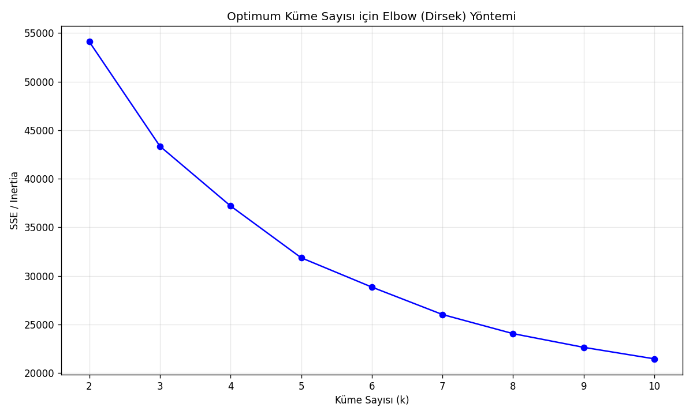
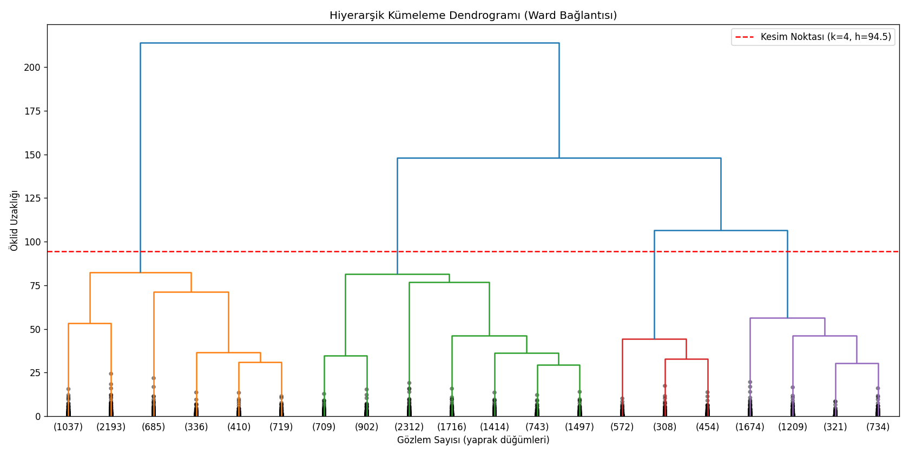

# 👟 FLO - Gözetimsiz Öğrenme ile Müşteri Segmentasyonu


Bu proje, [Miuul](https://www.miuul.com/) Data Scientist Bootcamp kapsamındaki **"Gözetimsiz Öğrenme ile Müşteri Segmentasyonu"** vaka çalışmasının uçtan uca çözümüdür. FLO'nun OmniChannel (hem online hem offline alışveriş yapan) müşterilerini **K-Means** ve **Hierarchical (Agglomerative) Clustering** yöntemleriyle davranışsal olarak segmentlere ayırır.

---

## 📑 İçindekiler

- [İş Problemi](#-i̇ş-problemi)
- [Veri Seti](#-veri-seti)
- [Proje Yapısı](#-proje-yapısı)
- [Yöntem](#-yöntem)
- [Sonuçlar](#-sonuçlar)
- [Kurulum ve Çalıştırma](#-kurulum-ve-çalıştırma)
- [Kullanılan Teknolojiler](#-kullanılan-teknolojiler)
- [Lisans](#-lisans)

---

## 🎯 İş Problemi

FLO, müşterilerini segmentlere ayırıp bu segmentlere özel pazarlama stratejileri belirlemek istemektedir. Bunun için müşterilerin alışveriş davranışları tanımlanmış ve bu davranışlardaki öbeklenmelere göre **gözetimsiz öğrenme (unsupervised learning)** teknikleriyle gruplar oluşturulmuştur.

## 📊 Veri Seti

Veri seti, FLO'dan 2020-2021 yıllarında OmniChannel olarak alışveriş yapan müşterilerin geçmiş davranışlarından oluşmaktadır: **19.945 müşteri, 12 değişken**.

| Değişken | Açıklama |
|---|---|
| `master_id` | Eşsiz müşteri numarası |
| `order_channel` | Alışverişin yapıldığı kanal (Android, iOS, Desktop, Mobile) |
| `last_order_channel` | En son alışverişin yapıldığı kanal |
| `first_order_date` | Müşterinin ilk alışveriş tarihi |
| `last_order_date` | Müşterinin son alışveriş tarihi |
| `last_order_date_online` / `_offline` | Online / offline son alışveriş tarihi |
| `order_num_total_ever_online` / `_offline` | Online / offline toplam alışveriş sayısı |
| `customer_value_total_ever_online` / `_offline` | Online / offline toplam harcama |
| `interested_in_categories_12` | Son 12 ayda alışveriş yapılan kategoriler |

> Veri seti gizlilik açısından herkese açık bir eğitim veri setidir (Miuul bootcamp materyali) ve kişisel/hassas bilgi içermez.

## 📂 Proje Yapısı

```
flo-musteri-segmentasyonu/
│
├── data/
│   └── flo_data_20k.csv              # Ham veri seti
│
├── outputs/                          # Script çalıştırıldığında üretilen çıktılar
│   ├── 01_elbow_yontemi.png          # K-Means için Elbow (dirsek) grafiği
│   ├── 02_kmeans_segment_dagilimi.png
│   ├── 03_dendrogram.png             # Hierarchical Clustering dendrogramı
│   ├── 04_hc_segment_dagilimi.png
│   ├── kmeans_segment_istatistikleri.csv
│   ├── hc_segment_istatistikleri.csv
│   ├── kmeans_vs_hc_karsilastirma.csv
│   └── musteri_segmentleri.csv       # Her müşterinin nihai segment etiketleri
│
├── flo_musteri_segmentasyonu.py      # Uçtan uca analiz scripti
├── requirements.txt
├── .gitignore
├── LICENSE
└── README.md
```

## 🧠 Yöntem

### Görev 1 — Veriyi Hazırlama
- Veri okutuldu, tarih sütunları `datetime` tipine çevrildi.
- Segmentasyon için 4 davranışsal değişken türetildi:
  - **`order_num_total`**: Online + offline toplam alışveriş sayısı (Frequency)
  - **`customer_value_total`**: Online + offline toplam harcama (Monetary)
  - **`recency`**: Son alışverişten bu yana geçen gün sayısı
  - **`tenure`**: İlk alışverişten bu yana geçen gün sayısı (müşteri yaşı)

### Görev 2 — K-Means ile Segmentasyon
- `order_num_total` ve `customer_value_total` değişkenleri belirgin şekilde sağa çarpık olduğundan (çarpıklık katsayıları sırasıyla ~9.1 ve ~17.4) önce **log dönüşümü** (`log1p`), ardından **`StandardScaler`** ile standartlaştırma uygulandı.
- Optimum küme sayısı, **k=2..10** için SSE (Elbow yöntemi) ve **Silhouette Skoru** birlikte incelenerek belirlendi. SSE düşüş hızının belirgin şekilde yavaşladığı nokta **k=5** olarak seçildi.
- `KMeans(n_clusters=5, random_state=17)` modeli kuruldu ve her müşteriye bir segment etiketi atandı.
- Her segment; ortalama/medyan alışveriş sayısı, harcama, recency ve tenure değerleriyle istatistiksel olarak incelendi.

### Görev 3 — Hierarchical Clustering ile Segmentasyon
- Görev 2'de standartlaştırılan aynı veri kümesi kullanılarak **Ward bağlantı yöntemi** ile dendrogram oluşturuldu.
- Dendrogramdaki en büyük birleşme sıçramaları ile Silhouette skorları birlikte değerlendirilerek optimum küme sayısı **k=4** olarak belirlendi.
- `AgglomerativeClustering(n_clusters=4, linkage="ward")` ile müşteriler segmentlendi ve istatistiksel olarak incelendi.
- Son olarak K-Means ve Hierarchical Clustering sonuçları bir **çapraz tablo (crosstab)** ile karşılaştırıldı.

## 📈 Sonuçlar

### K-Means Segmentleri (k=5, Silhouette ≈ 0.259)

| Segment | Müşteri Sayısı | Ort. Alışveriş Sayısı | Ort. Harcama (₺) | Ort. Recency (gün) | Ort. Tenure (gün) | Yorum |
|:---:|---:|---:|---:|---:|---:|---|
| 0 | 6.343 | 2,6 | 316 | 187 | 698 | 💤 Düşük değerli, uzun süredir pasif müşteriler |
| 1 | 2.580 | 13,1 | 2.021 | 94 | 1.271 | 👑 En yüksek sıklık ve harcamaya sahip VIP/şampiyon müşteriler |
| 2 | 5.928 | 5,1 | 776 | 182 | 925 | ⚠️ Orta-yüksek değerli ama pasifleşmeye başlayan müşteriler |
| 3 | 1.388 | 2,7 | 483 | 67 | 173 | 🆕 Yeni müşteriler (en düşük tenure) |
| 4 | 3.706 | 4,3 | 673 | 23 | 688 | ✅ Yakın zamanda alışveriş yapmış aktif/sadık müşteriler |

### Hierarchical Clustering Segmentleri (k=4, Silhouette ≈ 0.247)

| Segment | Müşteri Sayısı | Ort. Alışveriş Sayısı | Ort. Harcama (₺) | Ort. Recency (gün) | Ort. Tenure (gün) | Yorum |
|:---:|---:|---:|---:|---:|---:|---|
| 0 | 5.380 | 9,7 | 1.497 | 112 | 1.032 | 👑 VIP/şampiyon müşteriler |
| 1 | 3.938 | 3,6 | 516 | 32 | 657 | ✅ Yakın zamanda aktif müşteriler |
| 2 | 9.293 | 3,3 | 458 | 199 | 820 | 💤 Uykuda / kaybedilme riski taşıyan müşteriler |
| 3 | 1.334 | 2,7 | 483 | 79 | 170 | 🆕 Yeni müşteriler |

**Karşılaştırma:** İki yöntem de tutarlı bir müşteri hikâyesi anlatıyor — VIP/şampiyon müşteriler, yakın zamanda aktif müşteriler, yeni müşteriler ve pasifleşen/uykuda müşteriler şeklinde benzer arketipler her iki yöntemde de ortaya çıkıyor. K-Means, "uykuda" grubunu Hierarchical Clustering'e göre daha ince taneli biçimde ikiye ayırarak (segment 0 ve 2) pazarlama açısından daha aksiyona dönüştürülebilir bir ayrım sunuyor.

**Öne çıkan iş çıkarımı:** Toplam müşteri kitlesinin yaklaşık %47'si (K-Means segment 0 ve 2) son alışverişinin üzerinden ortalama 180+ gün geçmiş durumda. Bu grup, geri kazanım (win-back) kampanyalarının önceliklendirilmesi gereken en büyük fırsat alanını oluşturuyor.

Tüm grafikler `outputs/` klasöründe yer almaktadır:

<p align="center">
  
  
</p>

## ⚙️ Kurulum ve Çalıştırma

```bash
# Depoyu klonlayın
git clone https://github.com/<kullanici-adiniz>/flo-musteri-segmentasyonu.git
cd flo-musteri-segmentasyonu

# Sanal ortam oluşturup bağımlılıkları kurun
python -m venv venv
source venv/bin/activate  # Windows: venv\Scripts\activate
pip install -r requirements.txt

# Analizi çalıştırın
python flo_musteri_segmentasyonu.py
```

Script çalıştığında konsola tüm ara adımların (betimsel istatistikler, çarpıklık, SSE/Silhouette skorları, segment özetleri) çıktısını basar ve `outputs/` klasörüne grafik ile tablo dosyalarını kaydeder.

## 🛠 Kullanılan Teknolojiler

- **Python 3.9+**
- **pandas / numpy** — veri manipülasyonu ve özellik mühendisliği
- **scikit-learn** — `StandardScaler`, `KMeans`, `AgglomerativeClustering`, `silhouette_score`
- **scipy** — `linkage`, `dendrogram` (hiyerarşik kümeleme)
- **matplotlib** — görselleştirme

## 📄 Lisans

Bu proje [MIT Lisansı](LICENSE) ile lisanslanmıştır. Vaka çalışması metni ve veri seti [Miuul](https://www.miuul.com/) Data Scientist Bootcamp eğitim materyaline aittir; bu depo yalnızca eğitim amaçlı geliştirilen çözümü paylaşmaktadır.

---

<p align="center">Miuul Data Scientist Bootcamp — Gözetimsiz Öğrenme Modülü kapsamında hazırlanmıştır.</p>
